# image-diff MCP Server

A Model Context Protocol (MCP) server for programmatic image comparison and visual diff generation. Compares two images pixel-by-pixel, identifies clusters of visual differences, and generates heatmap visualizations.

Designed for comparing design mock screenshots against actual UI implementations.

## How It Works

1. **Pixel comparison** using YIQ NTSC perceptual color distance (accounts for how humans perceive color differences)
2. **Anti-aliasing detection** to filter out false positives from font smoothing and rounded corners
3. **Connected Component Labeling** to group adjacent diff pixels into spatial clusters
4. **Natural-breaks clustering** to auto-compute an optimal `cluster_gap` using nearest-neighbor distance analysis, merging nearby clusters into meaningful groups
5. **Heatmap generation** with yellow-to-red intensity gradient showing severity of differences
6. **Automatic alignment** for different-sized images using OpenCV ZNCC template matching

## Tools

### `get_diff_of_images`

Compare two images and get structured diff results.

**Parameters:**
| Parameter | Type | Required | Default | Description |
|-----------|------|----------|---------|-------------|
| `source_image` | string | Yes | - | Absolute path to the reference image |
| `target_image` | string | Yes | - | Absolute path to the comparison image |
| `threshold` | number | No | 0.1 | Color matching sensitivity (0-1, lower = more sensitive) |
| `include_aa` | boolean | No | false | Count anti-aliased pixels as differences |
| `min_cluster_size` | number | No | 4 | Minimum connected pixels to form a cluster |
| `cluster_gap` | number | No | auto | Max pixel gap to merge nearby clusters. When omitted, an optimal gap is auto-computed using nearest-neighbor distance analysis with natural breaks. Set to 0 for no merging, or any positive integer for manual control. |

**Returns:**

- `identical`: boolean indicating if images match
- `summary`: overall diff statistics (pixel counts, percentages, cluster count)
- `clusters`: array of diff regions with bounding boxes, severity ratings, and intensity metrics
- `clustering`: gap used, whether it was auto-computed, and suggested alternative gap values
- `alignment` (when images differ in size): position coordinates, confidence score, strategy used, and timing
- `dimensions`: width and height of the compared region
- `heatmapPath`: file path to the generated heatmap image
- `compositePath`: file path to the heatmap overlaid on the source image

**Requirements:**

- Images must be accessible as local file paths
- Supports PNG, JPEG, WebP, TIFF input formats
- Images can have different dimensions — the smaller image is automatically aligned within the larger one

#### Tool Call Shape

**MCP tool call input** (minimal — just the two required paths):

```json
{
  "name": "get_diff_of_images",
  "arguments": {
    "source_image": "/path/to/design-mock.png",
    "target_image": "/path/to/screenshot.png"
  }
}
```

**MCP tool call input** (with all optional parameters):

```json
{
  "name": "get_diff_of_images",
  "arguments": {
    "source_image": "/path/to/design-mock.png",
    "target_image": "/path/to/screenshot.png",
    "threshold": 0.05,
    "include_aa": true,
    "min_cluster_size": 10,
    "cluster_gap": 15
  }
}
```

**MCP response** (same-size images with differences):

```json
{
  "content": [
    {
      "type": "text",
      "text": "{\n  \"identical\": false,\n  \"summary\": {\n    \"totalPixels\": 480000,\n    \"diffPixels\": 737,\n    \"diffPercentage\": 0.154,\n    \"antiAliasedPixels\": 1034,\n    \"matchingPixels\": 478229,\n    \"clusterCount\": 11,\n    \"description\": \"0.15% of pixels differ across 11 cluster(s). Severity breakdown: 5 major, 5 minor, 1 trivial.\"\n  },\n  \"clustering\": {\n    \"gapUsed\": 4,\n    \"autoGap\": true,\n    \"suggestedSmallerGap\": 3,\n    \"suggestedLargerGap\": 5\n  },\n  \"clusters\": [ ... ],\n  \"heatmapPath\": \"/tmp/image-diff-output/heatmap-1234567890.png\",\n  \"compositePath\": \"/tmp/image-diff-output/composite-1234567890.png\",\n  \"dimensions\": { \"width\": 800, \"height\": 600 }\n}"
    }
  ]
}
```

The `text` field contains the full JSON result as a string. When parsed, the full response shape looks like this:

<details>
<summary>Full parsed response shape (same-size images, with differences)</summary>

```json
{
  "identical": false,
  "summary": {
    "totalPixels": 480000,
    "diffPixels": 737,
    "diffPercentage": 0.154,
    "antiAliasedPixels": 1034,
    "matchingPixels": 478229,
    "clusterCount": 11,
    "description": "0.15% of pixels differ across 11 cluster(s). Severity breakdown: 5 major, 5 minor, 1 trivial."
  },
  "clustering": {
    "gapUsed": 4,
    "autoGap": true,
    "suggestedSmallerGap": 3,
    "suggestedLargerGap": 5
  },
  "clusters": [
    {
      "id": 1,
      "left": 444,
      "top": 157,
      "right": 504,
      "bottom": 165,
      "width": 61,
      "height": 9,
      "pixelCount": 170,
      "totalImagePixels": 480000,
      "areaPercentage": 0.035,
      "meanIntensity": 0.111,
      "maxIntensity": 0.343,
      "severity": "minor"
    }
  ],
  "heatmapPath": "/tmp/image-diff-output/heatmap-1234567890.png",
  "compositePath": "/tmp/image-diff-output/composite-1234567890.png",
  "dimensions": {
    "width": 800,
    "height": 600
  }
}
```

</details>

<details>
<summary>Full parsed response shape (identical images)</summary>

```json
{
  "identical": true,
  "summary": {
    "totalPixels": 480000,
    "diffPixels": 0,
    "diffPercentage": 0,
    "antiAliasedPixels": 0,
    "matchingPixels": 480000,
    "clusterCount": 0,
    "description": "Images are identical (no differences detected)."
  },
  "clustering": {
    "gapUsed": 0,
    "autoGap": true,
    "suggestedSmallerGap": null,
    "suggestedLargerGap": null
  },
  "clusters": [],
  "heatmapPath": "/tmp/image-diff-output/heatmap-1234567890.png",
  "compositePath": "/tmp/image-diff-output/composite-1234567890.png",
  "dimensions": {
    "width": 800,
    "height": 600
  }
}
```

</details>

<details>
<summary>Full parsed response shape (different-size images — auto-alignment)</summary>

```json
{
  "identical": false,
  "summary": {
    "totalPixels": 108800,
    "diffPixels": 9031,
    "diffPercentage": 8.301,
    "antiAliasedPixels": 329,
    "matchingPixels": 99440,
    "clusterCount": 7,
    "description": "8.30% of pixels differ across 7 cluster(s). Severity breakdown: 1 major, 3 moderate, 3 minor."
  },
  "clustering": {
    "gapUsed": 4,
    "autoGap": true,
    "suggestedSmallerGap": 1,
    "suggestedLargerGap": 6
  },
  "clusters": [
    {
      "id": 1,
      "left": 20,
      "top": 185,
      "right": 299,
      "bottom": 215,
      "width": 280,
      "height": 31,
      "pixelCount": 8372,
      "totalImagePixels": 108800,
      "areaPercentage": 7.695,
      "meanIntensity": 0.242,
      "maxIntensity": 0.244,
      "severity": "major"
    }
  ],
  "alignment": {
    "x": 680,
    "y": 212,
    "confidence": 0.993,
    "strategy": "opencv-zncc-hybrid",
    "alignmentTimeMs": 89,
    "templateImage": "target",
    "originalDimensions": {
      "source": { "width": 1024, "height": 768 },
      "target": { "width": 320, "height": 340 }
    }
  },
  "heatmapPath": "/tmp/image-diff-output/heatmap-1234567890.png",
  "compositePath": "/tmp/image-diff-output/composite-1234567890.png",
  "dimensions": {
    "width": 320,
    "height": 340
  }
}
```

Note: The `alignment` field only appears when images have different dimensions. The `dimensions` field reflects the size of the compared region (the template size after alignment, not the full scene). The `compositePath` field is optional in the interface but always present when called via the MCP tool.

</details>

---

## Examples

All examples below use this dashboard as the **source image** (800x600):


---

### Example 1: Identical Images — No Differences

When two images are pixel-identical, the engine short-circuits and returns immediately.

| Source                                        | Target                                           | Composite                                           |
| --------------------------------------------- | ------------------------------------------------ | --------------------------------------------------- |
|  |  | 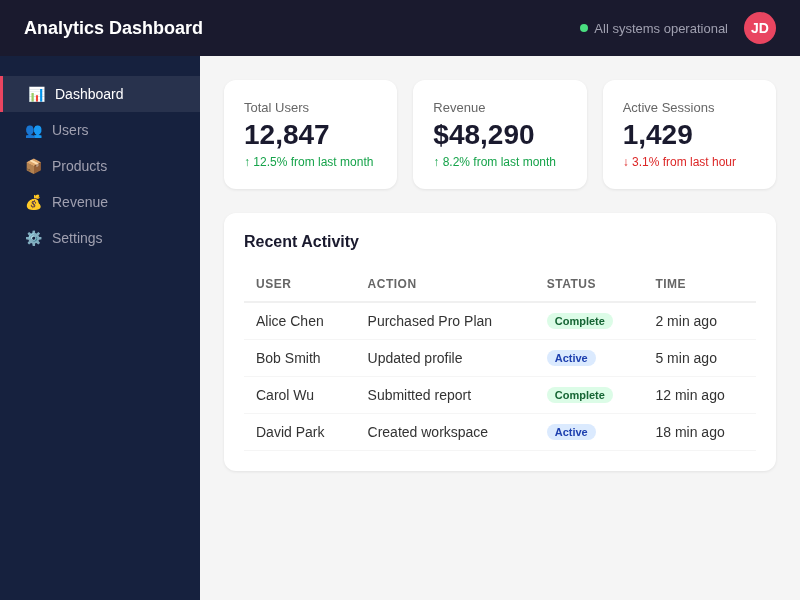 |

The composite overlay shows the source image with no heatmap highlights — because there are no differences.

<details>
<summary>Structured output</summary>

```json
{
  "identical": true,
  "summary": {
    "totalPixels": 480000,
    "diffPixels": 0,
    "diffPercentage": 0,
    "antiAliasedPixels": 0,
    "matchingPixels": 480000,
    "clusterCount": 0,
    "description": "Images are identical (no differences detected)."
  },
  "clustering": {
    "gapUsed": 0,
    "autoGap": true,
    "suggestedSmallerGap": null,
    "suggestedLargerGap": null
  }
}
```

</details>

---

### Example 2: Color & Value Changes

The target has updated stat values ("12,847" -> "13,205", "$48,290" -> "$52,180") and different percentage text. The engine finds **11 clusters** (auto gap=4) across the changed text and numbers.

| Source                                        | Target                                              |
| --------------------------------------------- | --------------------------------------------------- |
|  | 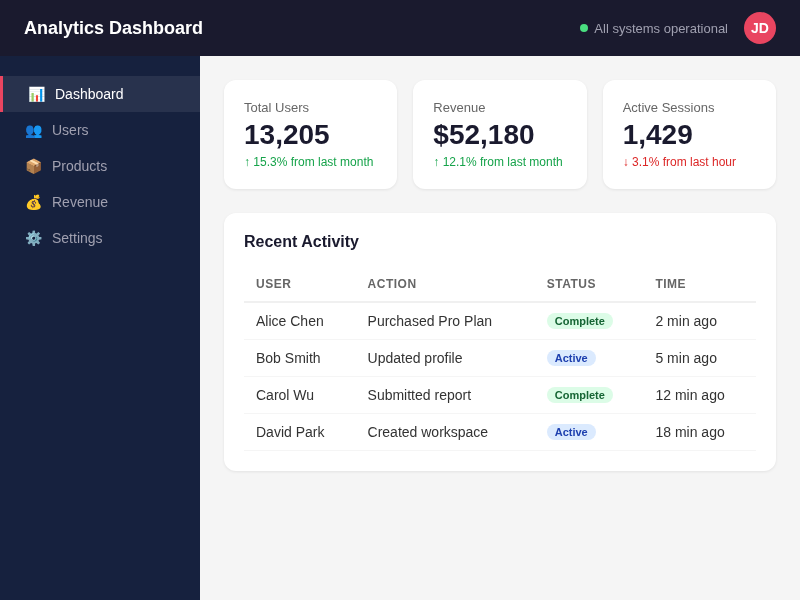 |

| Standalone Heatmap                                 | Composite Overlay                                      |
| -------------------------------------------------- | ------------------------------------------------------ |
| 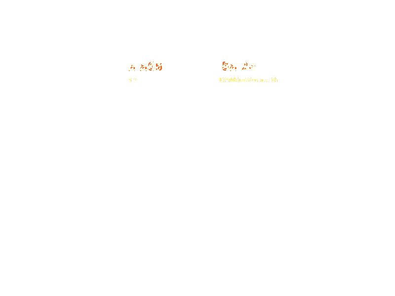 |  |

The **standalone heatmap** shows only the diff pixels on a transparent background — yellow means lower intensity, red means higher intensity. The **composite overlay** blends the heatmap onto the source image so you can see exactly where differences occur in context.

<details>
<summary>Structured output (11 clusters, top 3 shown)</summary>

```json
{
  "identical": false,
  "summary": {
    "totalPixels": 480000,
    "diffPixels": 737,
    "diffPercentage": 0.154,
    "antiAliasedPixels": 1034,
    "matchingPixels": 478229,
    "clusterCount": 11,
    "description": "0.15% of pixels differ across 11 cluster(s). Severity breakdown: 5 major, 5 minor, 1 trivial."
  },
  "clustering": {
    "gapUsed": 4,
    "autoGap": true,
    "suggestedSmallerGap": 3,
    "suggestedLargerGap": 5
  },
  "clusters": [
    {
      "id": 1,
      "left": 444,
      "top": 157,
      "right": 504,
      "bottom": 165,
      "width": 61,
      "height": 9,
      "pixelCount": 170,
      "areaPercentage": 0.035,
      "meanIntensity": 0.111,
      "maxIntensity": 0.343,
      "severity": "minor"
    },
    {
      "id": 2,
      "left": 450,
      "top": 125,
      "right": 478,
      "bottom": 142,
      "width": 29,
      "height": 18,
      "pixelCount": 112,
      "areaPercentage": 0.023,
      "meanIntensity": 0.677,
      "maxIntensity": 0.738,
      "severity": "major"
    },
    {
      "id": 3,
      "left": 284,
      "top": 126,
      "right": 308,
      "bottom": 142,
      "width": 25,
      "height": 17,
      "pixelCount": 91,
      "areaPercentage": 0.019,
      "meanIntensity": 0.682,
      "maxIntensity": 0.738,
      "severity": "major"
    }
  ]
}
```

_8 more clusters omitted._

</details>

---

### Example 3: Font Change (sans-serif -> serif)

The entire page is re-rendered with a serif font (Georgia). Every text element shifts slightly, producing many glyph-level differences. With the default auto-gap, the engine computes an optimal `cluster_gap=10` and merges these into **40 clusters** representing distinct text blocks and UI regions.

| Source                                        | Target                                             |
| --------------------------------------------- | -------------------------------------------------- |
|  |  |

| Standalone Heatmap                                | Composite Overlay                                     |
| ------------------------------------------------- | ----------------------------------------------------- |
| 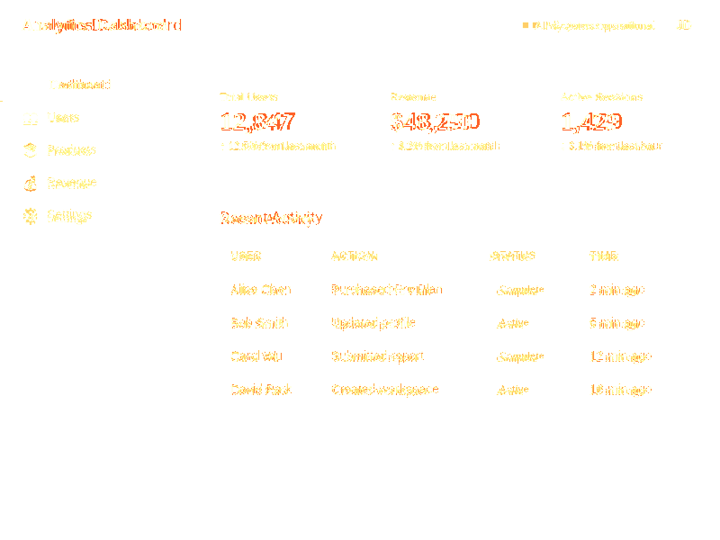 | 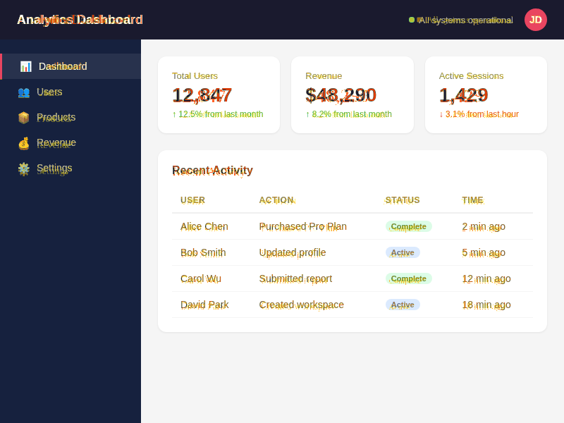 |

The heatmap lights up across every text region — headers, stat values, table content, sidebar labels. Auto-gap merges nearby glyph fragments into meaningful groups.

<details>
<summary>Structured output — default auto-gap (40 clusters, top 3 shown)</summary>

```json
{
  "identical": false,
  "summary": {
    "totalPixels": 480000,
    "diffPixels": 11671,
    "diffPercentage": 2.431,
    "antiAliasedPixels": 8326,
    "matchingPixels": 460003,
    "clusterCount": 40,
    "description": "2.43% of pixels differ across 40 cluster(s). Severity breakdown: 26 moderate, 14 minor."
  },
  "clustering": {
    "gapUsed": 10,
    "autoGap": true,
    "suggestedSmallerGap": 9,
    "suggestedLargerGap": 11
  },
  "clusters": [
    {
      "id": 1,
      "left": 434,
      "top": 125,
      "right": 550,
      "bottom": 166,
      "width": 117,
      "height": 42,
      "pixelCount": 912,
      "severity": "moderate"
    },
    {
      "id": 2,
      "left": 246,
      "top": 125,
      "right": 372,
      "bottom": 166,
      "width": 127,
      "height": 42,
      "pixelCount": 883,
      "severity": "moderate"
    },
    {
      "id": 3,
      "left": 625,
      "top": 125,
      "right": 733,
      "bottom": 166,
      "width": 109,
      "height": 42,
      "pixelCount": 716,
      "severity": "moderate"
    }
  ]
}
```

_37 more clusters omitted. Note: same diff pixels, same percentage — only the grouping changes._

</details>

#### What Auto-Gap Saves You From: `cluster_gap=0`

Without auto-gap, each glyph fragment becomes its own cluster. Setting `cluster_gap=0` explicitly disables merging:

| `cluster_gap`  | Clusters | What Happens                                           |
| -------------- | -------- | ------------------------------------------------------ |
| auto (default) | **40**   | Auto-computed gap=10 merges fragments into text blocks |
| 0 (no merging) | 331      | Every glyph fragment is a separate cluster             |

With `cluster_gap=0`, the 40 meaningful groups explode into **331 raw clusters** — one for every individual character difference. This is what auto-gap saves you from.

<details>
<summary>Structured output with cluster_gap=0 (331 clusters, top 3 shown)</summary>

```json
{
  "identical": false,
  "summary": {
    "totalPixels": 480000,
    "diffPixels": 11671,
    "diffPercentage": 2.431,
    "antiAliasedPixels": 8326,
    "matchingPixels": 460003,
    "clusterCount": 331,
    "description": "2.43% of pixels differ across 331 cluster(s). Severity breakdown: 61 major, 161 moderate, 105 minor, 4 trivial."
  },
  "clustering": {
    "gapUsed": 0,
    "autoGap": false,
    "suggestedSmallerGap": null,
    "suggestedLargerGap": 1
  },
  "clusters": [
    {
      "id": 1,
      "left": 65,
      "top": 88,
      "right": 110,
      "bottom": 98,
      "width": 46,
      "height": 11,
      "pixelCount": 221,
      "severity": "moderate"
    },
    {
      "id": 2,
      "left": 555,
      "top": 317,
      "right": 597,
      "bottom": 329,
      "width": 43,
      "height": 13,
      "pixelCount": 213,
      "severity": "moderate"
    },
    {
      "id": 3,
      "left": 555,
      "top": 391,
      "right": 597,
      "bottom": 403,
      "width": 43,
      "height": 13,
      "pixelCount": 213,
      "severity": "moderate"
    }
  ]
}
```

_328 more clusters omitted. Note: same diff pixels, same percentage — only the grouping changes._

</details>

---

### Example 4: Missing Elements (Badges Removed)

The target has status badges ("Complete", "Active") removed from the table — replaced with plain text. The engine detects **19 clusters** (auto gap=4) precisely locating each removed badge.

| Source                                        | Target                                                |
| --------------------------------------------- | ----------------------------------------------------- |
|  | 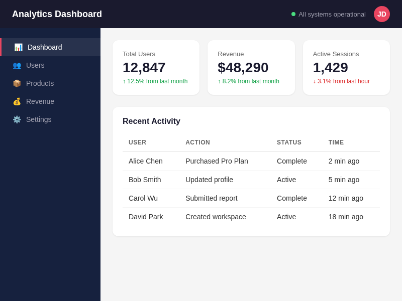 |

| Standalone Heatmap                                   | Composite Overlay                                        |
| ---------------------------------------------------- | -------------------------------------------------------- |
| 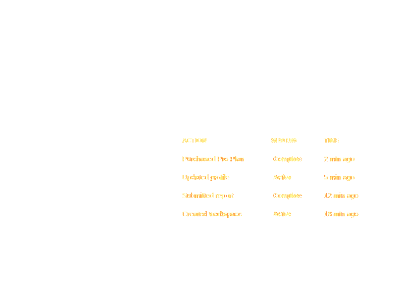 | 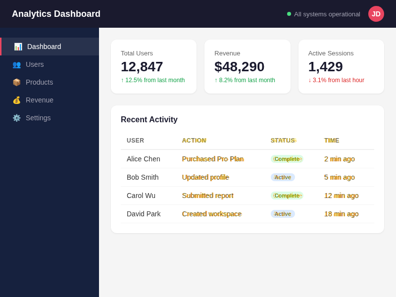 |

The heatmap highlights each badge position where the colored pill was replaced with plain text.

<details>
<summary>Structured output (19 clusters, top 3 shown)</summary>

```json
{
  "identical": false,
  "summary": {
    "totalPixels": 480000,
    "diffPixels": 4506,
    "diffPercentage": 0.939,
    "antiAliasedPixels": 2283,
    "matchingPixels": 473211,
    "clusterCount": 19,
    "description": "0.94% of pixels differ across 19 cluster(s). Severity breakdown: 18 moderate, 1 minor."
  },
  "clustering": {
    "gapUsed": 4,
    "autoGap": true,
    "suggestedSmallerGap": 3,
    "suggestedLargerGap": 5
  },
  "clusters": [
    {
      "id": 1,
      "left": 369,
      "top": 426,
      "right": 487,
      "bottom": 439,
      "width": 119,
      "height": 14,
      "pixelCount": 516,
      "areaPercentage": 0.108,
      "severity": "moderate"
    },
    {
      "id": 2,
      "left": 369,
      "top": 352,
      "right": 462,
      "bottom": 365,
      "width": 94,
      "height": 14,
      "pixelCount": 442,
      "areaPercentage": 0.092,
      "severity": "moderate"
    },
    {
      "id": 3,
      "left": 657,
      "top": 427,
      "right": 723,
      "bottom": 439,
      "width": 67,
      "height": 13,
      "pixelCount": 311,
      "areaPercentage": 0.065,
      "severity": "moderate"
    }
  ]
}
```

_16 more clusters omitted._

</details>

---

### Example 5: Layout Shift (Padding Change)

The target has increased padding and gaps on the stat cards — everything shifts down slightly. This produces **18 clusters** (auto gap=18) because the auto-gap merges the many edge-level fragments caused by content repositioning.

| Source                                        | Target                                              |
| --------------------------------------------- | --------------------------------------------------- |
|  | 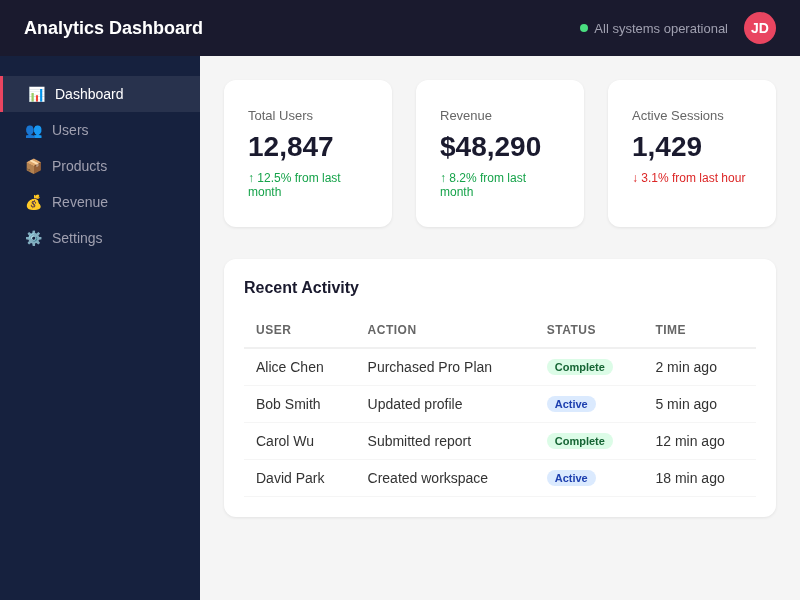 |

| Standalone Heatmap                                 | Composite Overlay                                      |
| -------------------------------------------------- | ------------------------------------------------------ |
| 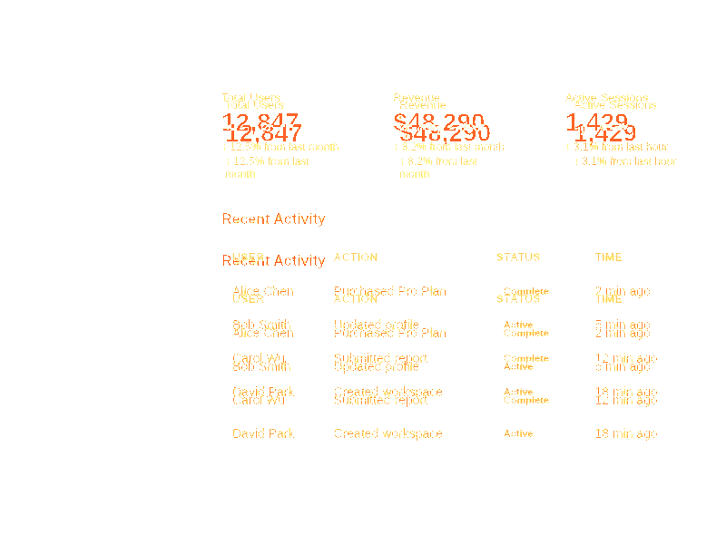 | 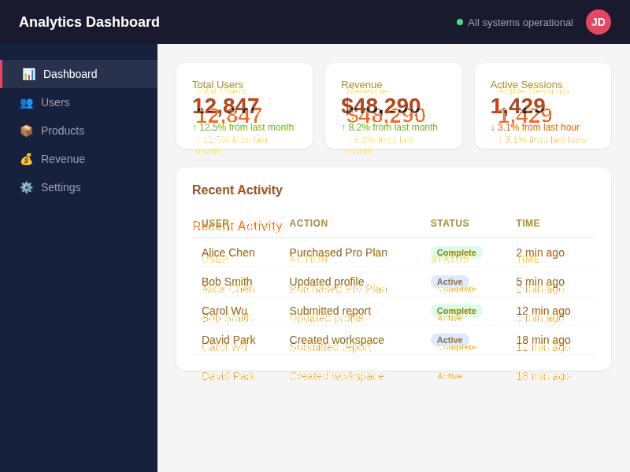 |

Layout shifts light up the heatmap everywhere content has repositioned. The auto-gap merges the ripple effect into cohesive regions representing each shifted element.

<details>
<summary>Structured output (18 clusters, top 3 shown)</summary>

```json
{
  "identical": false,
  "summary": {
    "totalPixels": 480000,
    "diffPixels": 11136,
    "diffPercentage": 2.32,
    "antiAliasedPixels": 10938,
    "matchingPixels": 457926,
    "clusterCount": 18,
    "description": "2.32% of pixels differ across 18 cluster(s). Severity breakdown: 18 moderate."
  },
  "clustering": {
    "gapUsed": 18,
    "autoGap": true,
    "suggestedSmallerGap": 17,
    "suggestedLargerGap": 19
  },
  "clusters": [
    {
      "id": 1,
      "left": 434,
      "top": 105,
      "right": 550,
      "bottom": 195,
      "width": 117,
      "height": 91,
      "pixelCount": 1531,
      "areaPercentage": 0.319,
      "severity": "moderate"
    },
    {
      "id": 2,
      "left": 369,
      "top": 315,
      "right": 490,
      "bottom": 448,
      "width": 122,
      "height": 134,
      "pixelCount": 1490,
      "areaPercentage": 0.31,
      "severity": "moderate"
    },
    {
      "id": 3,
      "left": 245,
      "top": 103,
      "right": 372,
      "bottom": 195,
      "width": 128,
      "height": 93,
      "pixelCount": 1473,
      "areaPercentage": 0.307,
      "severity": "moderate"
    }
  ]
}
```

_15 more clusters omitted._

</details>

---

## Auto-Alignment: Comparing Different-Sized Images

When the source and target have **different dimensions**, the engine automatically finds where the smaller image (the "template") best matches within the larger one (the "scene"), crops that region, and runs the standard pixel-level comparison. No configuration needed.

**How it works:**

1. **Coarse search** — OpenCV ZNCC (Zero-mean Normalized Cross-Correlation) template matching at downscaled resolution for fast candidate detection
2. **Fine refinement** — Pixel-level ZNCC at full resolution around the coarse match for sub-pixel accuracy
3. **Crop & compare** — The matched region is cropped from the scene and compared pixel-by-pixel against the template

This enables comparing a **Figma component mock** against a **full-page screenshot** directly — no manual cropping needed.

All alignment examples below use this dashboard as the **source (scene)** image (1024x768):

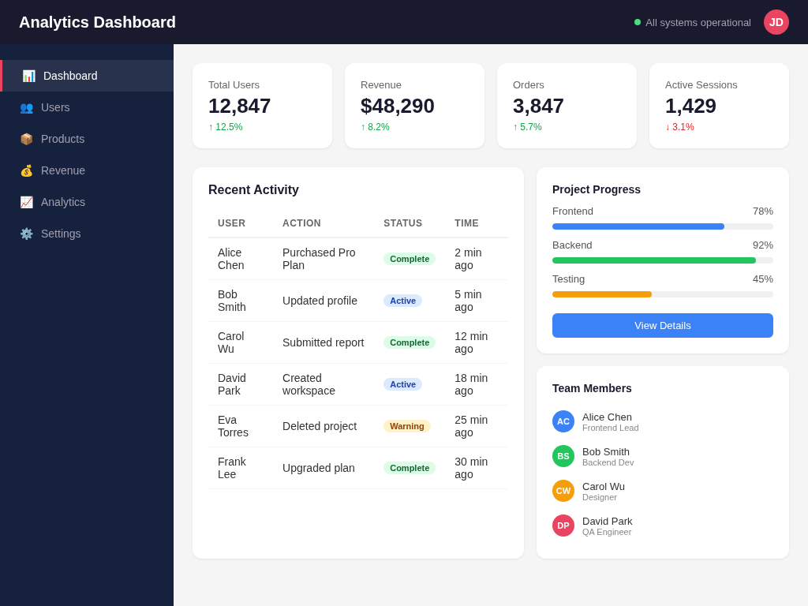

---

### Auto-Align Example 1: Stats Card Mock vs Full Page

A Figma mock of the stats row (780x100) compared against the full page (1024x768). The mock has updated numbers ("12,847" -> "14,205", "$48,290" -> "$52,180", "3,847" -> "4,102") and different percentages.

| Full Page (1024x768)                       | Stats Card Mock (780x100)                  |
| ------------------------------------------ | ------------------------------------------ |
|  | 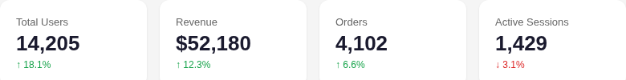 |

The engine automatically locates the stats row at position **(238, 80)**, crops that 780x100 region from the full page, and compares it against the mock.

| Composite Overlay (on cropped region)                      |
| ---------------------------------------------------------- |
| 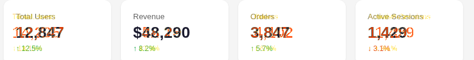 |

The heatmap highlights exactly the changed stat values and percentages within the aligned region.

<details>
<summary>Structured output (15 clusters, top 3 shown)</summary>

```json
{
  "identical": false,
  "summary": {
    "totalPixels": 78000,
    "diffPixels": 2570,
    "diffPercentage": 3.295,
    "antiAliasedPixels": 2503,
    "matchingPixels": 72927,
    "clusterCount": 15,
    "description": "3.29% of pixels differ across 15 cluster(s). Severity breakdown: 5 major, 4 moderate, 6 minor."
  },
  "clustering": {
    "gapUsed": 5,
    "autoGap": true,
    "suggestedSmallerGap": 4,
    "suggestedLargerGap": 6
  },
  "alignment": {
    "x": 238,
    "y": 80,
    "confidence": 0.743,
    "strategy": "opencv-zncc-hybrid",
    "alignmentTimeMs": 146,
    "templateImage": "target",
    "originalDimensions": {
      "source": { "width": 1024, "height": 768 },
      "target": { "width": 780, "height": 100 }
    }
  },
  "clusters": [
    {
      "id": 1,
      "left": 607,
      "top": 45,
      "right": 679,
      "bottom": 66,
      "width": 73,
      "height": 22,
      "pixelCount": 421,
      "areaPercentage": 0.54,
      "severity": "major"
    },
    {
      "id": 2,
      "left": 413,
      "top": 45,
      "right": 480,
      "bottom": 66,
      "width": 68,
      "height": 22,
      "pixelCount": 412,
      "areaPercentage": 0.528,
      "severity": "major"
    },
    {
      "id": 3,
      "left": 22,
      "top": 45,
      "right": 103,
      "bottom": 66,
      "width": 82,
      "height": 22,
      "pixelCount": 369,
      "areaPercentage": 0.473,
      "severity": "major"
    }
  ]
}
```

_12 more clusters omitted._

**Key fields in the `alignment` object:**

- `x`, `y` — where the template was found in the scene (pixel coordinates)
- `confidence` — match quality (0-1, higher is better)
- `strategy` — algorithm used (`opencv-zncc-hybrid`)
- `alignmentTimeMs` — how long alignment took
- `templateImage` — which image was the template (`"target"` means the target was smaller)
- `originalDimensions` — original sizes before alignment
</details>

---

### Auto-Align Example 2: Sidebar Panel Mock vs Full Page

A Figma mock of the right sidebar (320x340) with modified progress values (78->85%, 92->95%, 45->62%) and a different button color (blue -> red). Compared against the full page.

| Full Page (1024x768)                       | Sidebar Mock (320x340)                  |
| ------------------------------------------ | --------------------------------------- |
|  | 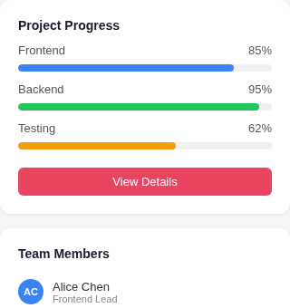 |

The engine finds the sidebar at position **(680, 212)** with **99.3% confidence** in **89ms**, then identifies the changed progress bars and button.

| Composite Overlay (on cropped region)                   | Standalone Heatmap                                  |
| ------------------------------------------------------- | --------------------------------------------------- |
| 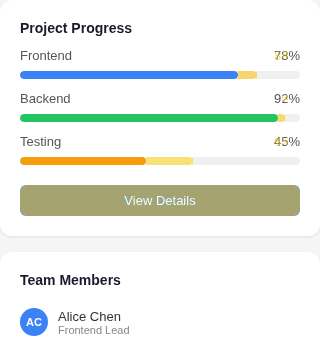 |  |

The major cluster at the bottom is the button color change (blue -> red). The moderate clusters are the progress bar fill changes.

<details>
<summary>Structured output (7 clusters, top 3 shown)</summary>

```json
{
  "identical": false,
  "summary": {
    "totalPixels": 108800,
    "diffPixels": 9031,
    "diffPercentage": 8.301,
    "antiAliasedPixels": 329,
    "matchingPixels": 99440,
    "clusterCount": 7,
    "description": "8.30% of pixels differ across 7 cluster(s). Severity breakdown: 1 major, 3 moderate, 3 minor."
  },
  "clustering": {
    "gapUsed": 4,
    "autoGap": true,
    "suggestedSmallerGap": 1,
    "suggestedLargerGap": 6
  },
  "alignment": {
    "x": 680,
    "y": 212,
    "confidence": 0.993,
    "strategy": "opencv-zncc-hybrid",
    "alignmentTimeMs": 89,
    "templateImage": "target",
    "originalDimensions": {
      "source": { "width": 1024, "height": 768 },
      "target": { "width": 320, "height": 340 }
    }
  },
  "clusters": [
    {
      "id": 1,
      "left": 20,
      "top": 185,
      "right": 299,
      "bottom": 215,
      "width": 280,
      "height": 31,
      "pixelCount": 8372,
      "areaPercentage": 7.695,
      "severity": "major"
    },
    {
      "id": 2,
      "left": 146,
      "top": 157,
      "right": 192,
      "bottom": 164,
      "width": 47,
      "height": 8,
      "pixelCount": 370,
      "areaPercentage": 0.34,
      "severity": "moderate"
    },
    {
      "id": 3,
      "left": 238,
      "top": 71,
      "right": 256,
      "bottom": 78,
      "width": 19,
      "height": 8,
      "pixelCount": 146,
      "areaPercentage": 0.134,
      "severity": "moderate"
    }
  ]
}
```

_4 more clusters omitted._

</details>

---

### Auto-Align Example 3: Identical Crop — 0% Diff

An exact crop of the activity table (420x496) from the same full page screenshot. The engine finds the table at the exact position and confirms **0% diff** — proving alignment precision.

| Full Page (1024x768)                       | Table Crop (420x496)                            |
| ------------------------------------------ | ----------------------------------------------- |
|  |  |

| Composite Overlay (clean — no diffs)                            |
| --------------------------------------------------------------- |
| 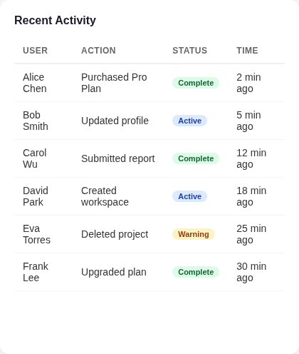 |

<details>
<summary>Structured output</summary>

```json
{
  "identical": true,
  "summary": {
    "totalPixels": 208320,
    "diffPixels": 0,
    "diffPercentage": 0,
    "antiAliasedPixels": 0,
    "matchingPixels": 208320,
    "clusterCount": 0,
    "description": "Images are identical (no differences detected)."
  },
  "clustering": {
    "gapUsed": 0,
    "autoGap": true,
    "suggestedSmallerGap": null,
    "suggestedLargerGap": null
  },
  "alignment": {
    "x": 244,
    "y": 212,
    "confidence": 1,
    "strategy": "opencv-zncc-hybrid",
    "alignmentTimeMs": 99,
    "templateImage": "target",
    "originalDimensions": {
      "source": { "width": 1024, "height": 768 },
      "target": { "width": 420, "height": 496 }
    }
  }
}
```

100% confidence, 0 diff pixels. The alignment found the exact position and the cropped region matches perfectly.

</details>

---

### Alignment Performance

| Scenario          | Template | Scene    | Position Found | Confidence | Time  |
| ----------------- | -------- | -------- | -------------- | ---------- | ----- |
| Stats card        | 780x100  | 1024x768 | (238, 80)      | 74.3%      | 146ms |
| Sidebar panel     | 320x340  | 1024x768 | (680, 212)     | 99.3%      | 89ms  |
| Table (identical) | 420x496  | 1024x768 | (244, 212)     | 100%       | 99ms  |

---

## Cluster Severity Ratings

Each diff cluster is classified by severity based on pixel count and intensity:

| Severity     | Meaning                         | Typical Cause                                               |
| ------------ | ------------------------------- | ----------------------------------------------------------- |
| **trivial**  | Isolated pixel differences      | Sub-pixel rendering, compression artifacts                  |
| **minor**    | Small localized differences     | Slight color shifts, font weight changes                    |
| **moderate** | Noticeable regional differences | Text changes, badge modifications                           |
| **major**    | Large or intense differences    | Button color changes, missing/added elements, layout shifts |

---

## Example Agent Skills

The `example-skills/` directory contains ready-to-use [Agent Skills](https://agentskills.io) that demonstrate how to build workflows on top of the image-diff MCP server.

### `implement-figma-design`

An iterative design implementation skill that coordinates three MCP servers — Figma, Playwright, and image-diff — to build a UI component that matches a Figma design. The agent writes code, screenshots the running dev server, diffs against the Figma reference, diagnoses each diff cluster's root cause (color mismatch, typography, spacing, missing elements, etc.), applies fixes, and loops until the diff converges to <= 0.01%.

**Pre-requisites:** Figma MCP server, Playwright MCP server, image-diff MCP server, a working dev server.

**To use:** Copy `example-skills/implement-figma-design/` into your project's `.claude/skills/` directory (or equivalent skill location for your agent platform).

---

## Credits

- Pixel comparison algorithm forked from [pixelmatch](https://github.com/mapbox/pixelmatch) by Mapbox (ISC License)
- Color distance based on "Measuring perceived color difference using YIQ NTSC transmission color space in mobile applications" by Y. Kotsarenko and F. Ramos
- Anti-aliasing detection based on "Anti-aliased Pixel and Intensity Slope Detector" by V. Vysniauskas, 2009
- Connected Component Labeling uses the classic two-pass algorithm with Union-Find
- Image alignment powered by [opencv-wasm](https://github.com/niconiahi/opencv-wasm) (Apache 2.0 License)
- Image I/O powered by [sharp](https://github.com/lovell/sharp) (Apache 2.0 License)
- Clustering approach inspired by [looks-same](https://github.com/gemini-testing/looks-same) by Gemini Testing (MIT License)
